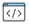
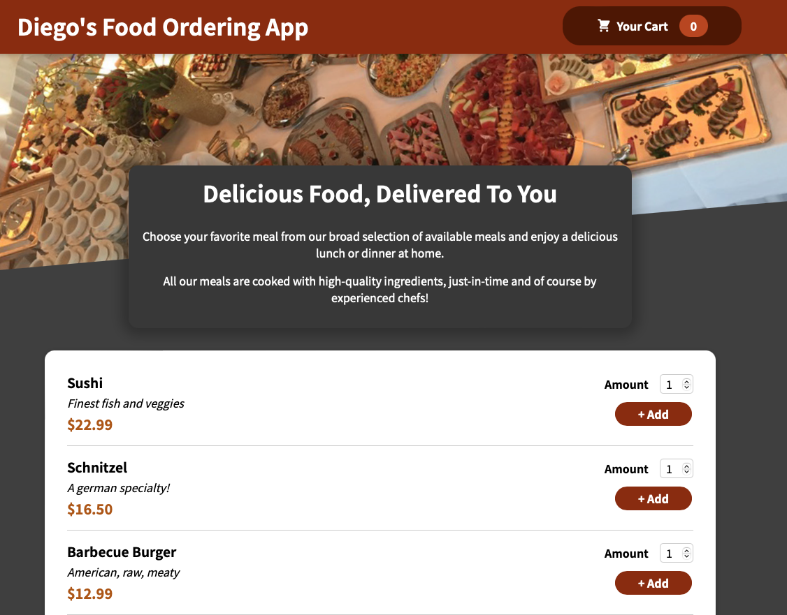

# Diego's Food ordering app
Just practicing react with a food ordering app

\**Check the link **inside the icon**  to see this knowledge being applied in this codebase.

<>

## What I've learned and refreshed my knowledge on React:

- Scoping components with either [styled components](https://styled-components.com) or [CSS modules](https://github.com/css-modules/css-modules)  (helps avoid UI styles bugs or unwanted behavior by scoping the CSS styles of a component and not letting it be applied globally)
- [React Fragments](https://reactjs.org/docs/fragments.html) (Improves accessibility by avoid unnecessary html nodes)
- [React Portals](https://reactjs.org/docs/portals.html) (Also improves accessibility by being able to move elements in the DOM where  it’s most suitable for accessibility, i.e: moving a modal and backdrop to top of DOM instead of being nested on the DOM)
- [React ref](https://reactjs.org/docs/refs-and-the-dom.html) (it actually does  a lot of things for example helps with unnecessary states when you only need to read a value for some input field for example)
- Avoid unnecessary calls to useEffect by passing properties from an object not the whole object as dependencies.
- [Forward Refs](https://reactjs.org/docs/forwarding-refs.html) ( a special case when you need to use the ref from a custom component, not from standard HTML  elements by using the useRef and useImperativeHandler hooks, wrapping the custom component with React.forwardRef helper function.
- Implemented [Absolute Imports](https://create-react-app.dev/docs/importing-a-component/#absolute-imports)  (This is great for productivy as you don't waste time going up and down when using relative path imports)

## Preview

